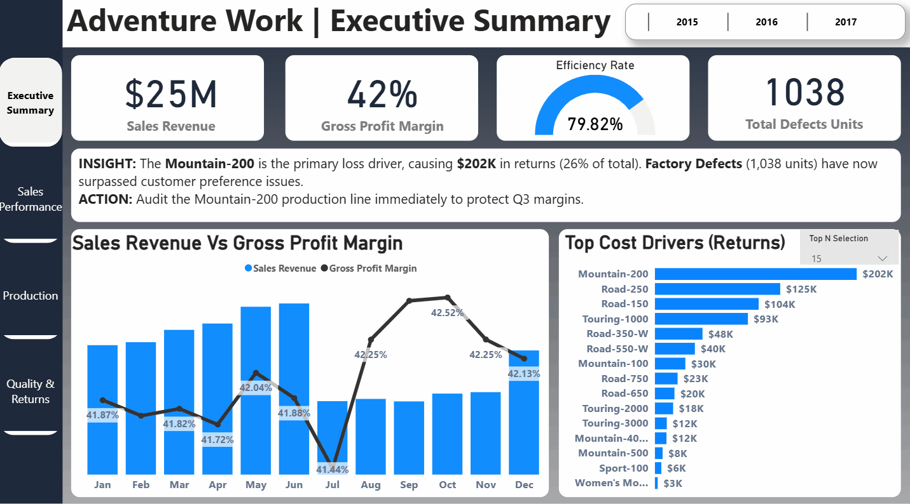
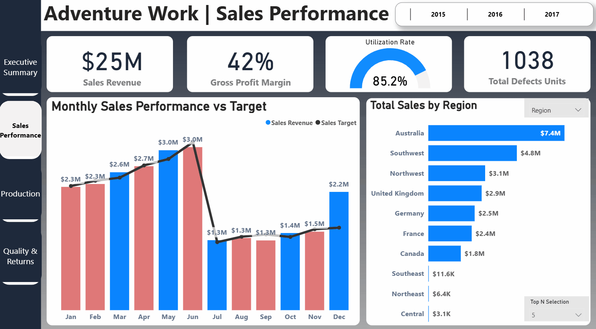
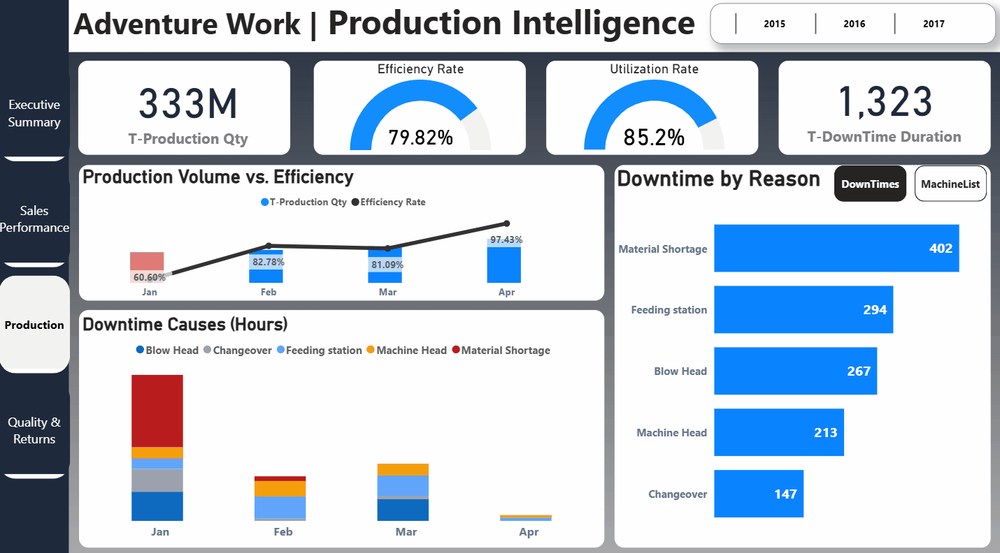
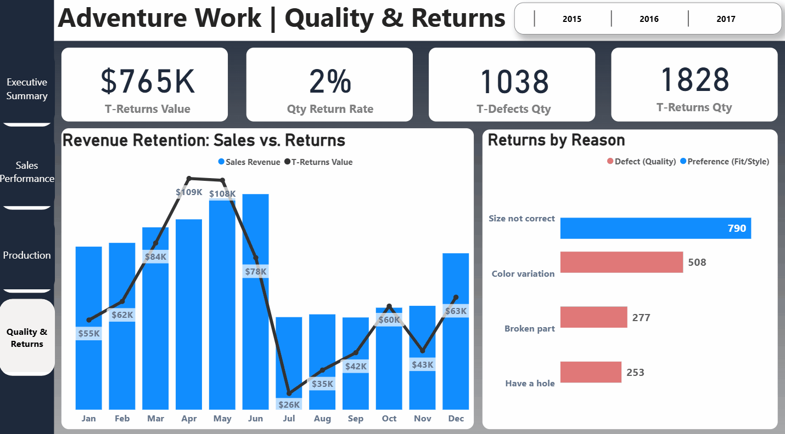
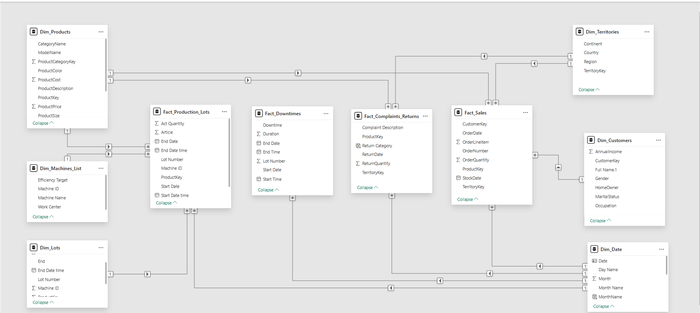

# 🚲 Adventure Works 360°: Profitability & Operational Audit

### **Executive Summary**
[cite_start]This project is a comprehensive BI audit of a manufacturing company generating **$25M in Revenue** with a **42% Gross Profit Margin** [cite: 15-17]. The goal was to bridge the gap between sales performance and operational inefficiencies.

**🚨 The "Million Dollar" Discovery:**
I identified that the **Mountain-200** bicycle is the primary loss driver, responsible for **$202K in returns** (26% of total return value). This insight triggered a recommendation to audit the production line immediately.

### 📊 **The Solution (Live Demos)**

#### 1. Executive Overview
> *Dynamic analysis using Field Parameters to switch between Region, Country, and Category views instantly.*

#### 2. Sales Performance Trends
> *Time-intelligence analysis tracking revenue growth vs. targets across key markets.*

#### 3. Production Intelligence (Efficiency Audit)
> *Tracked 1,323 total downtime hours. Identified **Material Shortage (402 Hours)** as the #1 bottleneck, impacting the 79.8% Efficiency Rate.*

#### 4. Quality Control & Returns (Drill-Through Analysis)
> *Deep-dive navigation: Right-clicking "Mountain-200" to reveal it causes $202K in returns due to factory defects.*

---

### 🛠️ **Technical Architecture**

#### **1. Advanced Data Modeling (Star Schema)**
Designed a robust schema integrating **4 Fact Tables** to connect disparate business units:
* `Fact_Sales`: Transactional revenue data ($23.6M Sales in Bikes).
* `Fact_Production_Lots`: Manufacturing efficiency and lot tracking.
* `Fact_Downtimes`: Machine stoppage duration (1,323 Hours analyzed).
* `Fact_Complaints_Returns`: Defect classification and return costs.
* *Connected via shared dimensions (`Dim_Products`, `Dim_Date`, `Dim_Machines`).*

#### **2. Advanced Power BI Features**
* **Field Parameters:** Enabled users to dynamically change x-axis dimensions (Region vs. Occupation) without needing separate charts.
* **Drill-Through Logic:** Implemented deep dives from "Bikes Category" ($23.6M) down to specific "Mountain-200" SKU performance.
* **Numeric Parameters:** Allowed "Top N" filtering to isolate the top 5 or 10 cost drivers dynamically.

### 📉 **Business Impact Analysis**
* **Strategic Action:** Recommended an immediate audit of the Mountain-200 production line to protect Q3 margins.
* **Vendor Management:** Highlighted **Material Shortages** as the root cause of 30% of total downtime, signaling a need for better supplier agreements.
* **Revenue Recovery:** Isolated **$202K** in specific product losses that were previously hidden in aggregate data.

---
*Created by [Saleh Hossam](https://saleh-hossam.github.io) | Tools: Power BI, DAX, Power Query*
