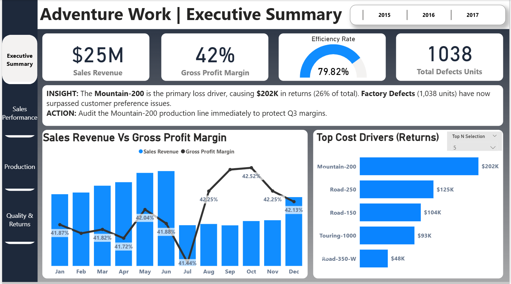
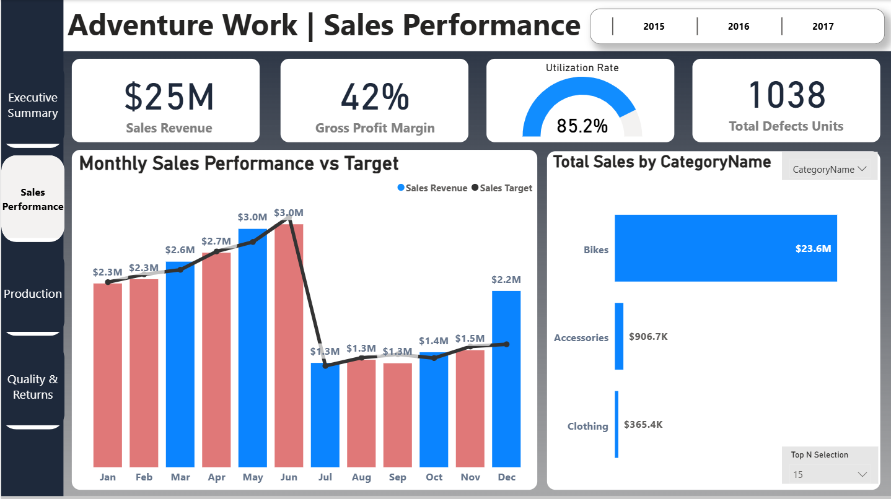
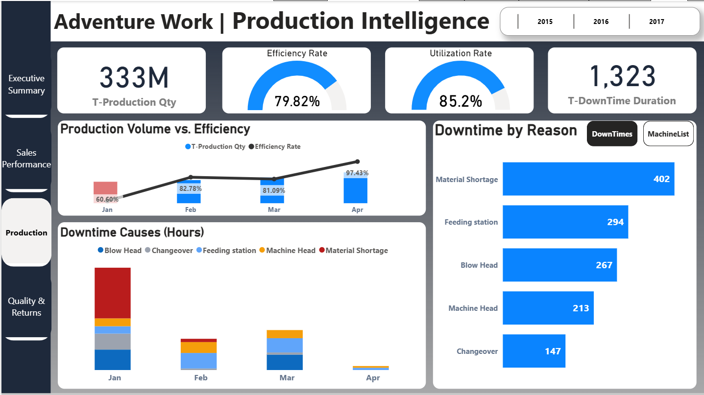
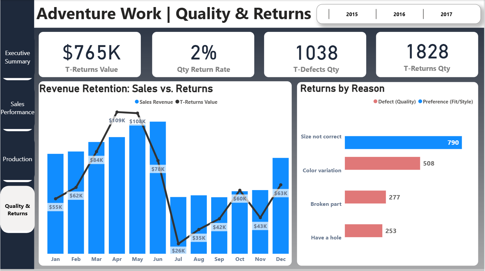

# 🚲 Adventure Works 360°: End-to-End Business Intelligence

### **Executive Summary**
This project is a full-scale BI solution for a global manufacturing company ($25M Revenue). It bridges **Sales Performance**, **Production Efficiency**, and **Quality Control** to identify profit leakage.

**The "Million Dollar" Insight:**
Discovered that a single product, the **Mountain-200**, is the primary driver of returns, costing the company **$202K** (26% of total return value).

### 📊 **The Solution (Dashboard Previews)**

#### 1. Executive Overview
> *Dynamic analysis using Field Parameters to switch between Region, Country, and Category views instantly.*

#### 2. Sales Performance Trends
> *Deep dive into revenue vs. target analysis across different time periods.*

#### 3. Production Intelligence
> *Monitoring 79.82% Efficiency Rates and tracking 402 hours of downtime due to Material Shortages.*

#### 4. Revenue Retention (Returns Analysis)
> *Drill-down into the $202K loss driver. Identified "Size Not Correct" and "Color Variation" as top defect reasons.*

---

### 🛠️ **Technical Architecture**

#### **1. Advanced Data Modeling (Star Schema)**
I moved beyond simple one-table analyses by architecting a complex Star Schema involving **3 Fact Tables**:
* `Fact_Sales`: Transactional revenue data.
* `Fact_Production`: Manufacturing lots and efficiency metrics.
* `Fact_Downtimes`: Machine stoppage duration and reasons.
* *Connected via shared dimensions (`Dim_Products`, `Dim_Date`, `Dim_Machines`).*

#### **2. Advanced Power BI Features**
* **Field Parameters:** Enabled users to dynamically change x-axis dimensions (Region vs. Occupation) without needing separate charts.
* **Bookmarks & Selection Pane:** Created a toggle experience to switch between "Downtime by Reason" and "Machine List" views.
* **Numeric Parameters:** Allowed "Top N" filtering to isolate the top 5, 10, or 15 cost drivers dynamically.

### 📉 **Business Impact Analysis**
* **Revenue Protection:** Identified **$137k** in recoverable revenue by targeting specific high-return product categories.
* **Operational Efficiency:** Pinpointed **Material Shortage (402 Hours)** as the leading cause of downtime, signaling a need for better vendor management.
* **Strategic Audit:** Recommended an immediate audit of the **Mountain-200** production line due to a 26% defect contribution.

---
*Created by [Saleh Hossam](https://saleh-hossam.github.io) | Tools: Power BI, DAX, Power Query*
